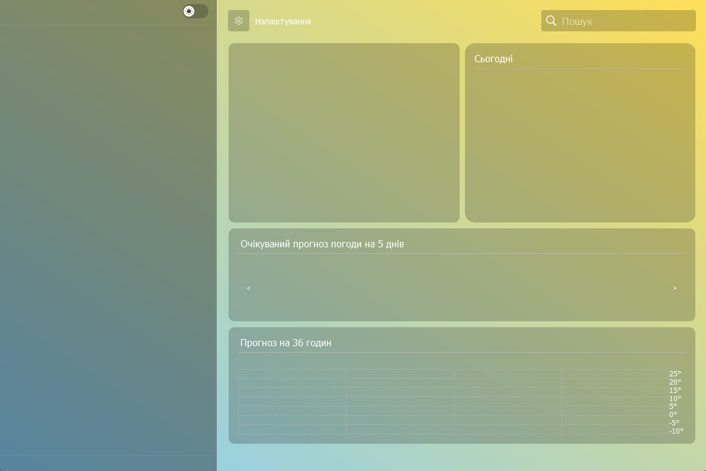
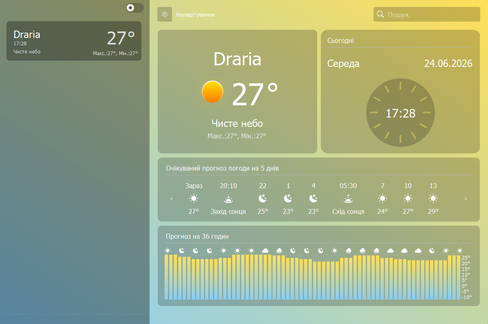

# Weather_Project

A desktop weather application developed with Python and PyQt6.

- 🇺🇦 [Українська](#-українська)
- 🇬🇧 [English](#-english)
  
---

# 🇺🇦 Українська

## Мета створення проєкту

Метою проєкту було створення настільного застосунку для перегляду поточної погоди в різних містах світу. Під час розробки були закріплені навички роботи з PyQt6, Weather API, обробкою JSON-файлів та організацією багатомодульного Python-проєкту.

---

## Склад команди

| Учасник | GitHub |
|---------|--------|
| Ростислав Тищенко | https://github.com/rostikprogrammer228 |
| Єгор Столяров | https://github.com/YehorStoliarov |
| Білаш Євген | https://github.com/BilashEvgen |

---

## Зміст

- [Мета створення проєкту](#мета-створення-проєкту)
- [Склад команди](#склад-команди)
- [Перелік модулів та технологій](#перелік-модулів-та-технологій)
- [Як запустити проєкт](#як-запустити-проєкт)
- [Структура проєкту](#структура-проєкту)
- [Зміст проєкту](#зміст-проєкту)
- [Зображення](#зображення)
- [Висновок](#висновок)

---

## Перелік модулів та технологій

### Мови програмування

- Python 3

### Бібліотеки

- PyQt6
- Requests

### Технології

- REST API
- JSON
- Object-Oriented Programming (OOP)

---

## Як запустити проєкт

1. Клонувати репозиторій

git clone https://github.com/BilashEvgen/Weather-project.git

2. Перейти до папки проєкту

cd Weather_Project

3. (Необов'язково) Створити віртуальне середовище

Windows

python -m venv venv

Linux/macOS

python3 -m venv venv

4. Активувати середовище

Windows

venv\Scripts\activate

Linux/macOS

source venv/bin/activate

5. Встановити залежності

pip install -r requirements.txt

6. Запустити застосунок

python main.py

---

## Структура проєкту

---

### main.py

Точка входу в програму. Ініціалізує застосунок та запускає головне вікно.

### modules/

Містить основну логіку програми:

- взаємодію з API погоди;
- обробку отриманих даних;
- роботу з графічним інтерфейсом;
- допоміжні класи та функції.

### config.py

Зберігає конфігурацію застосунку та глобальні константи.

### json/

Містить JSON-файли, що використовуються програмою для збереження та обробки даних.

### media/

Містить ресурси застосунку:

- іконки;
- зображення;
- графічні елементи інтерфейсу.

---

## Зображення

### Головне вікно

### Результат пошуку погоди

---

## Висновок

Під час виконання проєкту були отримані практичні навички створення графічних застосунків на PyQt6, роботи з REST API, HTTP-запитами та JSON. Також був отриманий досвід організації багатомодульного Python-проєкту та командної розробки. Надалі проєкт можна розширити збереженням інформації після перезапуску додатку.

---

# 🇬🇧 English

## Project Goal

The goal of this project was to develop a desktop weather application for viewing current weather conditions in cities around the world. During development, the project helped improve skills in PyQt6 GUI development, REST API integration, HTTP requests, JSON processing, and organizing a modular Python application.

---

## Team Members

| Member | GitHub |
|---------|--------|
| Rostyslav Tyshchenko | https://github.com/rostikprogrammer228 |
| Yehor Stoliarov | https://github.com/YehorStoliarov |
| Bilash Evgen | https://github.com/BilashEvgen |

---

## Contents

- [Project Goal](#project-goal)
- [Team Members](#team-members)
- [Modules and Technologies](#modules-and-technologies)
- [Installation](#installation)
- [Project Structure](#project-structure)
- [Project Overview](#project-overview)
- [Screenshots](#screenshots)
- [Conclusion](#conclusion)

---

## Modules and Technologies

### Programming Language

- Python 3

### Libraries

- PyQt6
- Requests

### Technologies

- REST API
- JSON
- Object-Oriented Programming (OOP)

---

## Project Summary
## Installation

1. Clone the repository

git clone https://github.com/rostikprogrammer228/Weather_Project.git

2. Navigate to the project folder

cd Weather_Project

3. (Optional) Create a virtual environment

Windows

python -m venv venv

Linux/macOS

python3 -m venv venv

4. Activate the environment

Windows

venv\Scripts\activate

Linux/macOS

source venv/bin/activate

5. Install the required dependencies

pip install -r requirements.txt

6. Run the application

python main.py

---

## Project Structure

---

### main.py

Application entry point. Initializes the application and launches the main window.

### modules/

Contains the core application logic, including:

- weather API communication;
- data processing;
- graphical interface management;
- utility classes and helper functions.

### config.py

Stores application configuration and global constants.

### json/

Contains JSON files used to store and process application data.

### media/

Contains application resources:

- icons;
- images;
- graphical interface assets.

---

## Screenshots

### Main Window

### Weather Search Result

---

## Conclusion

This project provided practical experience in developing desktop applications with PyQt6, integrating REST APIs, processing JSON data, and organizing a modular Python project. It also improved teamwork and software architecture skills. Future improvements may include saving information after the app is restarted

Weather_Project is a Python desktop application that demonstrates GUI development with PyQt6, REST API integration, JSON data processing, modular project architecture, and HTTP requests in an interactive weather application.
