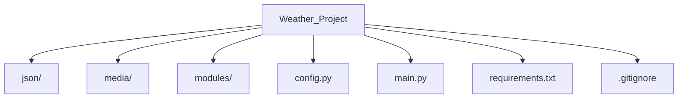

# Weather_Project

## Project Description

Weather_Project is a desktop weather application written in Python using PyQt6. The application allows users to search for current weather conditions in different cities by retrieving data from a weather API. The project demonstrates GUI development, API integration, JSON processing, and HTTP requests.

## Installation and Running Instructions

1. Clone the repository

   ```bash
   git clone https://github.com/rostikprogrammer228/Weather_Project.git
   ```

2. Navigate to the project folder

   ```bash
   cd Weather_Project
   ```

3. (Optional) Create a virtual environment

   **Windows**

   ```bash
   python -m venv venv
   ```

   **macOS/Linux**

   ```bash
   python3 -m venv venv
   ```

4. Activate the virtual environment

   **Windows**

   ```bash
   venv\Scripts\activate
   ```

   **macOS/Linux**

   ```bash
   source venv/bin/activate
   ```

5. Install the required dependencies

   ```bash
   pip install -r requirements.txt
   ```

6. Run the project

   ```bash
   python main.py
   ```

## Project Structure



## Module Documentation

### main.py

Entry point of the application. Initializes the program, creates the main window, and starts the application.

### modules/

Contains the core application logic, including:

* Weather API communication
* GUI components
* JSON data processing
* Utility functions
* Custom widgets

### config.py

Stores application configuration, API settings, and constants used throughout the project.

### json/

Stores JSON files used by the application, including:

* Current weather data
* Forecast data
* Geocoding results
* Saved application settings

### media/

Contains application resources such as:

* Weather icons
* Interface images
* Window icons

## Project Summary

Weather_Project is a Python desktop application that demonstrates GUI development with PyQt6, REST API integration, JSON data processing, modular project architecture, and HTTP requests in an interactive weather application.
